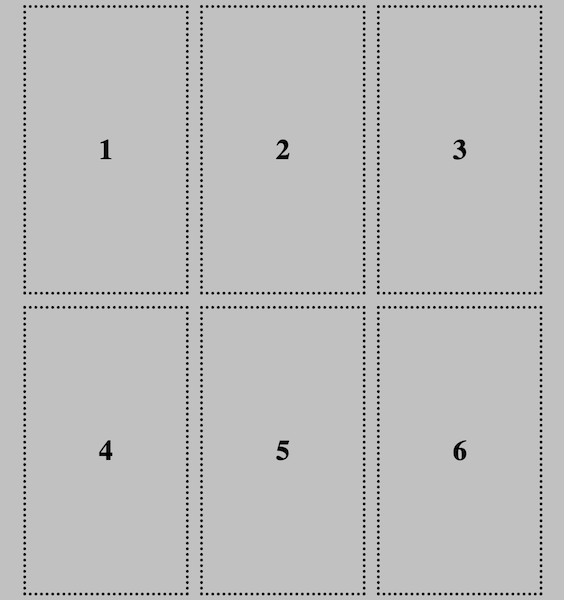
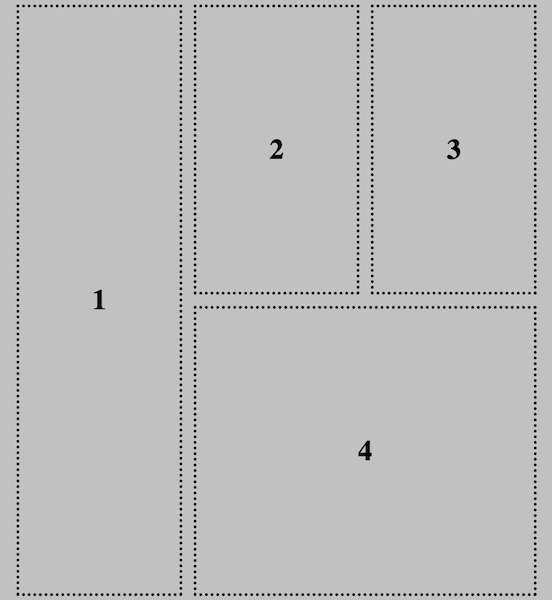

One of the best parts about using a grid layout is that it allows you to precisely place items. 

### Default placement

By default, when you put elements in a container with the `display: grid;` property, each item will take up **one grid cell** ordered first left to right and then top to bottom.

One way you can control the placement of your elements is by changing the order of the actual HTML. 

### Stretching items across rows and columns

If you want to stretch elements so they cover more than one row or column, you can use the following properties:
+ `grid-row-start` & `grid-row-end`
+ `grid-column-start` & `grid-column-end`

The `grid-row-start` property is the **first** row the element will display in. 

`grid-row-end` is the row where the element ends. The image will **not** display on this row.

The same works for `grid-column-start` & `grid-column-end`.

You add these properties to the class for the element you want to stretch. 

--- code ---
---
language: css
filename: style.css 
---

.stretch-rows {
    grid-row-start: 1;
    grid-row-end: 3;
}

--- /code ---

--- code ---
---
language: css
filename: style.css 
---

.stretch-columns {
    grid-column-start: 2;
    grid-column-end: 4;
}

--- /code ---

