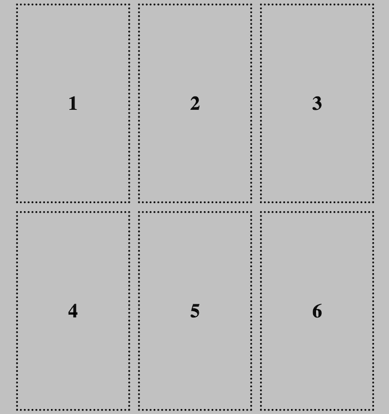

L'un des avantages de l'utilisation d'une grille est qu'elle permet de placer les éléments avec précision.

### Placement par défaut

Par défaut, lorsque tu places des éléments dans un conteneur avec la propriété `display : grid;`, chaque élément occupera **une cellule de la grille**, ordonnée d'abord de gauche à droite, puis de haut en bas.

Une façon de contrôler le placement de tes éléments est de modifier l'ordre du code HTML actuel.

### Étirement des éléments sur des lignes et des colonnes

Si tu veux étirer des éléments pour qu'ils occupent plus d'une ligne ou d'une colonne, tu peux utiliser les propriétés suivantes :

- `grid-row-start` et `grid-row-end`
- `grid-column-start` et `grid-column-end`

La propriété `grid-row-start` est la **première** ligne dans laquelle l'élément s'affichera.

`grid-row-end` est la ligne où l'élément se termine : l'image ne sera **pas** affichée sur cette ligne.

Il en va de même pour `grid-column-start` et `grid-column-end`.

Tu ajoutes ces propriétés à la classe de l'élément que tu veux étirer.

--- code ---
---
language: css
filename: style.css 
---

.stretch-rows {
    grid-row-start: 1;
    grid-row-end: 3;
}

--- /code ---

--- code ---
---
language: css
filename: style.css 
---

.stretch-columns {
    grid-column-start: 2;
    grid-column-end: 4;
}

--- /code ---

