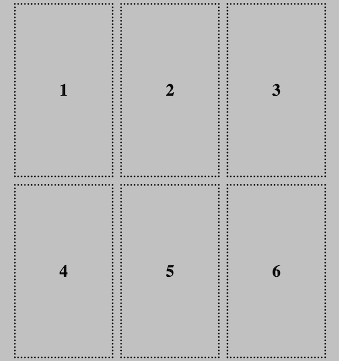

Een van de beste aspecten van een rasterindeling is dat je items heel nauwkeurig kunt plaatsen.

### Standaard plaatsing

Wanneer je elementen in een container plaatst met de eigenschap `display: grid;`, neemt elk item standaard **één rastercel** in beslag, gesorteerd van links naar rechts en vervolgens van boven naar beneden.

Eén manier waarop je de plaatsing van jouw elementen kunt bepalen, is door de volgorde van de HTML zelf te wijzigen.

### Items over rijen en kolommen verspreiden

Als je elementen wilt uitrekken zodat ze meer dan één rij of kolom beslaan, kun je de volgende eigenschappen gebruiken:

- `grid-row-start` & `grid-row-end`
- `grid-column-start` & `grid-column-end`

De `grid-row-start` eigenschap is de **eerste** rij waarin het element wordt weergegeven.

`grid-row-end` is de rij waar het element eindigt — de afbeelding zal **niet** op deze rij worden weergegeven.

Hetzelfde geldt voor `grid-column-start` & `grid-column-end`.

Je voegt deze eigenschappen toe aan de klasse van het element dat je wilt spreiden.

## --- code ---

language: css
filename: style.css
---------------------------------------------------

.stretch-rows {
grid-row-start: 1;
grid-row-end: 3;
}

\--- /code ---

## --- code ---

language: css
filename: style.css
---------------------------------------------------

.stretch-columns {
grid-column-start: 2;
grid-column-end: 4;
}

\--- /code ---

