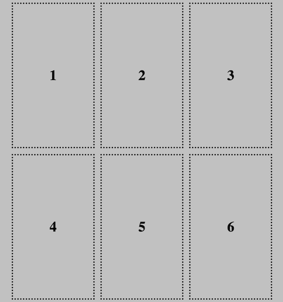
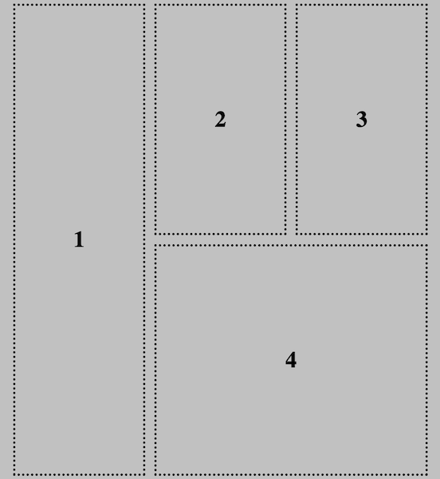

使用网格布局的最大优点之一是它允许你精确地放置内容项。

### 默认展示位置

默认情况下，当你将元素放入具有 `display: grid;` 属性的容器中时，每个内容项将占据**一个网格单元**，先从左到右，然后从上到下。

控制元素位置的一种方法是通过更改实际 HTML 的顺序。

### 跨行和跨列延展内容项

如果要延展元素以使其覆盖多行或多列，则可以使用以下属性：

- `grid-row-start` & `grid-row-end`
- `grid-column-start` & `grid-column-end`

`grid-row-start` 属性是元素将显示的**第一**行。

`grid-row-end` 是元素结束的行。 图像**不会**显示在此行。

对于 `grid-column-start` 和 `grid-column-end` 也同样适用。

将这些属性添加到你想要延展的元素的类中。

--- code ---
---
language: css
filename: style.css 
---

.stretch-rows {
    grid-row-start: 1;
    grid-row-end: 3;
}

--- /code ---

--- code ---
---
language: css
filename: style.css 
---

.stretch-columns {
    grid-column-start: 2;
    grid-column-end: 4;
}

--- /code ---

